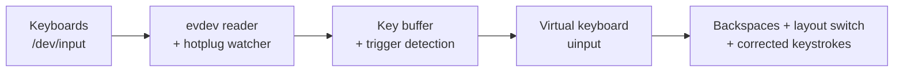
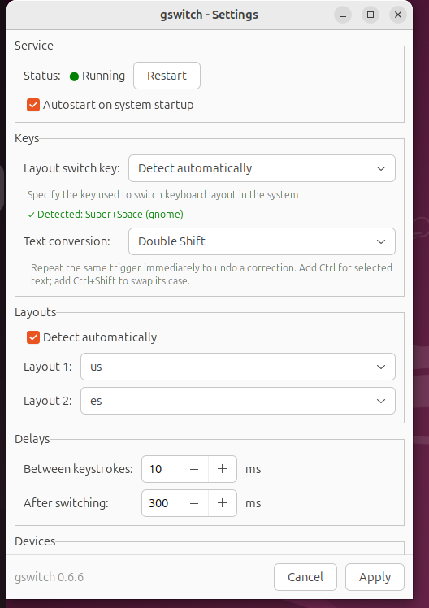

# gswitch

[](https://github.com/arumata/gswitch/releases)
[](https://github.com/arumata/gswitch/actions/workflows/ci.yml)
[](go.mod)
[](LICENSE)

**gswitch** fixes text typed in the wrong keyboard layout, system-wide on X11
and Wayland. It does not guess your language or change text in the background.
You press a trigger when you want a correction.

You typed a word, but the wrong layout was active:

| You got | You meant | Layout pair |
|---|---|---|
| `ghbdtn` | `привет` | English ↔ Russian |
| `ghbdsn` | `привіт` | English ↔ Ukrainian |
| `yeit` | `zeit` | English ↔ German (QWERTZ) |
| `qwerty` | `azerty` | English ↔ French (AZERTY) |
| `espa;ol` | `español` | English ↔ Spanish |

By default, double-tap <kbd>Shift</kbd> to fix the last word. Hold one
<kbd>Shift</kbd> and double-tap the other to fix the current phrase. You can
also convert selected text, swap its case, or repeat a correction immediately
to undo it. If Double Shift conflicts with an IDE or another application,
choose Pause/Break, Scroll Lock, or another single key in Settings.

Word and phrase correction runs at the Linux input layer. gswitch reads
keystrokes from `/dev/input` (evdev) and replays corrections through a virtual
keyboard (`uinput`). Typed-text correction therefore works across applications
without browser extensions, editor plugins, or toolkit-specific integration.

## Features

- **Manual and deterministic.** gswitch changes text only when you press the
  correction trigger. It does not try to detect the language you intended.
- **Word, phrase, selection, case, and undo.** Fix the last word or current
  phrase, convert a selection, change the case of selected letters, or
  immediately undo the last word or phrase correction.
- **System-wide typed-text correction.** The evdev/uinput path works below the
  display server on X11 and Wayland. Selection conversion uses the desktop
  clipboard path.
- **Five release-gate layout pairs.** The suite tests English paired with
  Russian, Ukrainian, German QWERTZ, French AZERTY, and Spanish in both
  directions. The XKB conversion tables cover more scripts, but other pairs
  are not yet part of the release gate.
- **Multiple keyboards with hotplug.** gswitch watches several input devices
  and picks up keyboards connected after startup.
- **Separate layout and shortcut detection.** Configured layouts are read from
  fcitx5, IBus, KDE, GNOME, or XKB sources. The layout-switch shortcut is
  detected from XKB options, including KDE's XKB settings, or from GNOME
  keybindings. More than two configured layouts require an explicit pair.
- **A user service, not a root daemon.** systemd runs gswitch as the graphical
  user; udev/logind grants the active session access through `uaccess`.
- **Ready-to-install, auditable releases.** Tagged releases include x86-64
  DEB, RPM, and tar.gz artifacts with checksums. The source is MIT-licensed.
- **Tray and custom trigger.** The tray shows status, edits settings, controls
  the user service, and offers Pause/Break and Scroll Lock presets or another
  single correction key.

## How It Works



1. gswitch silently buffers your keystrokes (buffer is reset on focus-changing keys: <kbd>Tab</kbd>, arrows, mouse clicks, …).
2. When it sees a trigger, it emits backspaces to erase the mistyped text, presses your layout-switch hotkey, and replays the buffered keys — now in the correct layout.
3. For selected text, it either converts characters using your system's XKB layout tables or swaps letter case, then pastes the result.

## Security & Privacy

A tool that reads every keystroke deserves scrutiny — here is the full picture:

- **No network code.** gswitch never sends anything anywhere; there is not a single network call in the codebase.
- **Keystrokes never touch the disk.** The key buffer lives only in process memory and is cleared whenever focus can change (mouse click, <kbd>Tab</kbd>, arrows, <kbd>Enter</kbd>, …). Debug mode writes operational metadata to the terminal only; it does not log key names, buffer contents, or selected/converted text.
- **The daemon does not run as root.** udev/logind grants the active local
  session access to keyboard event nodes and `/dev/uinput`. Only installation
  and writing the fixed system config use administrator authorization; service
  control is `systemctl --user`. Details in
  [the security policy](.github/SECURITY.md).
- **Releases are built by CI from a git tag** with GoReleaser and ship a `checksums.txt`; the full source is here to audit.

Found a vulnerability? See [the security policy](.github/SECURITY.md) for
private reporting.

## Tested Environments

The current release was verified with packaged binaries, synthetic keyboard
input, and real desktop sessions in six combinations:

| Distribution | Desktop | Display server | Package |
|---|---|---|---|
| Ubuntu 24.04 | GNOME 46 | Wayland | DEB |
| Ubuntu 24.04 | GNOME 46 | X11 | DEB |
| Ubuntu 24.04 | KDE Plasma 5.27 | Wayland | DEB |
| Ubuntu 24.04 | KDE Plasma 5.27 | X11 | DEB |
| Fedora 44 | GNOME 50 | Wayland | RPM (SELinux enforcing) |
| Fedora 44 | KDE Plasma 6.7 | Wayland | RPM (SELinux enforcing) |

Each combination covers layout detection, word and phrase correction,
immediate undo, selection conversion, selection case swap, the user service,
and the tray across all five release-gate layout pairs. These are the tested
boundaries, not a claim that every desktop, input method, or layout pair has
been verified.

## Installation

Requirements: Linux with `uinput`, systemd/logind for packaged device ACLs and
service mode, and administrator access to install the package. The daemon runs
as the graphical user. Selection conversion on pure Wayland additionally needs
`wl-clipboard` (installed automatically where supported).

Prebuilt packages currently target 64-bit x86 Linux (`amd64`/`x86_64`).

### From packages (recommended)

Download the latest `.deb` or `.rpm` from [Releases](https://github.com/arumata/gswitch/releases):

```bash
sudo apt install ./gswitch_<version>_linux_amd64.deb   # Debian/Ubuntu
sudo dnf install ./gswitch_<version>_linux_amd64.rpm   # Fedora

sudo gswitch --configure
systemctl --user enable --now gswitch.service
```

The package installs the daemon, the tray application, a systemd unit, udev rules, icons, and a polkit policy. The tray starts automatically on next login.

### With Go

```bash
go install github.com/arumata/gswitch/cmd/gswitch@latest
```

Installs the daemon binary only — no systemd unit, udev rules, or tray.
Clipboard-based selection conversion requires a CGO-enabled build.

### From source

```bash
git clone https://github.com/arumata/gswitch.git
cd gswitch
go build -o builds/gswitch ./cmd/gswitch
```

## Quick Start

```bash
# 1) Interactive setup (writes /etc/gswitch/default.conf)
sudo gswitch --configure

# 2) Try it in the foreground with verbose terminal diagnostics
gswitch --debug

# 3) Then run it as a service
systemctl --user enable --now gswitch.service
```

Type a word in the wrong layout and double-tap <kbd>Shift</kbd>. This is the
default trigger; use the tray application's Settings window to replace it with
another key.

## Usage

| Action | Default trigger | With custom `convert-key` |
|---|---|---|
| Fix last word | Double-<kbd>Shift</kbd> | <kbd>ConvertKey</kbd> |
| Fix whole phrase | Hold <kbd>Shift</kbd> + double-tap other <kbd>Shift</kbd> | <kbd>Shift</kbd>+<kbd>ConvertKey</kbd> |
| Convert selection | <kbd>Ctrl</kbd> + double-<kbd>Shift</kbd> | <kbd>Ctrl</kbd>+<kbd>ConvertKey</kbd> |
| Swap selection case | Hold <kbd>Ctrl</kbd> and one <kbd>Shift</kbd> + double-tap other <kbd>Shift</kbd> | <kbd>Ctrl</kbd>+<kbd>Shift</kbd>+<kbd>ConvertKey</kbd> |
| Undo last correction | Repeat the same trigger immediately | Repeat the same trigger immediately |

### CLI

```text
gswitch --configure                # interactive configuration (-c)
gswitch --run                      # run in foreground (-r)
gswitch --debug                    # verbose terminal diagnostics, no text content (-d)
gswitch --version                  # print version (-v)
gswitch --detect-layout-switch     # detect layout-switch hotkey, JSON output
        [--source=xkb|gnome|kde]   # restrict detection to one provider
```

### Tray application

`gswitch-tray` is optional. It shows the service status in the system tray and
provides a settings window (trigger key capture, delays, service start/stop).
It controls the daemon through `systemctl --user`; polkit is used only when
writing the system config.

It selects the desktop's native tray protocol automatically: StatusNotifierItem
on KDE, GNOME with an AppIndicator extension, and other SNI hosts; XEmbed on
X11 desktops such as Awesome 4.3. StatusNotifierItem is preferred when both
hosts are available.



#### Running without a tray host

If the desktop provides neither StatusNotifierItem nor XEmbed, `gswitch-tray`
exits with a diagnostic message instead of remaining invisibly active.

The daemon does not depend on the tray. With an installed package, configure
and run it directly:

```bash
sudo gswitch -c
systemctl --user enable --now gswitch.service
systemctl --user status gswitch.service --no-pager
```

Only the configuration command needs `sudo`; the daemon runs as the graphical
user.

To disable its autostart, create `~/.config/autostart/gswitch-tray.desktop` containing:

```ini
[Desktop Entry]
Hidden=true
```

## Configuration

Config file: `/etc/gswitch/default.conf`

| Parameter | Description | Default |
|---|---|---|
| `layout-switch` | Layout-switch key scancode(s): `auto`, single (`125`), or combo (`29+42`) | `auto` |
| `convert-key` | One evdev scancode for the correction trigger; `0` = double-Shift mode (combinations are rejected) | `0` |
| `delay` | Delay between synthetic key events, ms | `10` |
| `layout-switch-delay` | Extra delay after the layout switch, ms | `100` |
| `blacklist` | Comma-separated device UIDs to ignore | — |
| `layout1`, `layout2` | Explicit layout pair, e.g. `us` / `ru` or `ua(unicode)` | auto-detected |

Minimal example:

```ini
layout-switch=auto
convert-key=0
delay=10
layout-switch-delay=100
```

Notes:

- `layout-switch=auto` detects your hotkey from XKB options, GNOME keybindings, or KDE settings; run `gswitch --detect-layout-switch` to see what it finds.
- On GNOME X11, auto mode keeps your existing layout-switch shortcuts and adds `XF86Launch7` as a persistent internal accelerator. gswitch emits its standard X11 key slot (`KEY_F16`) instead of replaying an unreliable modifier shortcut such as `Super+Space`.
- The tray converts GTK/XKB hardware keycodes to evdev scancodes when capturing keys. For manual configuration, use `sudo showkey` to look up scancodes.
- With more than two layouts configured in the system, set `layout1`/`layout2` explicitly.
- Run `gswitch -d` to see device UIDs for `blacklist`.

### Layout detection order

Layouts for text conversion are detected from, in order: **fcitx5** (`~/.config/fcitx5/profile`) → **ibus** (gsettings) → **KDE** (`~/.config/kxkbrc`) → **GNOME** (gsettings input-sources) → **setxkbmap** (X11 fallback).

## Troubleshooting

**Service fails to start** — check logs:
`journalctl --user -u gswitch.service -f`.

**Selection conversion does nothing on Wayland** — the packages pull in `wl-clipboard` automatically as a recommended dependency; if it is missing (installed with `dpkg -i` / `--no-install-recommends`, or built from source), install it manually.

**Only one layout detected** — make sure at least two layouts are configured in your desktop settings; with more than two, set `layout1`/`layout2` in the config.

**Layout resets when clicking the tray or taskbar** — that is your desktop's *per-window* layout mode, not gswitch. Switch to a global layout policy:

<details>
<summary>How to enable global layout mode per desktop</summary>

- **KDE Plasma (XKB):** System Settings → Keyboard → Layouts → Switching Policy → *Global*
- **KDE Plasma (fcitx5):** Input Method → Global Options → Share Input State → *All*
- **GNOME:** `gsettings set org.gnome.desktop.input-sources per-window false`
- **Cinnamon:** `gsettings set org.cinnamon.desktop.input-sources per-window false`
- **MATE:** `gsettings set org.mate.peripherals-keyboard-xkb.general group-per-window false`
- **Xfce:** Keyboard → Layout → Layout switching → *Global*
- **LXQt:** Keyboard and Mouse → Keyboard Layout → uncheck *Per window*

</details>

**Known limitations**

- More than two simultaneous layouts require explicit `layout1`/`layout2`.
- Non-systemd distros: run the binary from the graphical session and arrange
  equivalent device ACLs manually.
- Fast user switching does not revoke input file descriptors already opened by
  another logged-in user; log out inactive users when strict isolation matters.
- Device ACLs are granted to a user ID, so every unsandboxed process running as
  that user can use the same device permissions while the ACL is active.

## License

[MIT](LICENSE)
