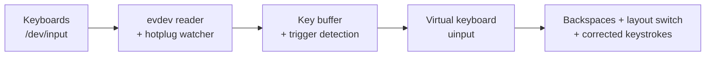

# gswitch

[](https://github.com/arumata/gswitch/releases)
[](https://github.com/arumata/gswitch/actions/workflows/ci.yml)
[](https://goreportcard.com/report/github.com/arumata/gswitch)
[](https://pkg.go.dev/github.com/arumata/gswitch)
[](go.mod)
[](LICENSE)

**gswitch** fixes text typed in the wrong keyboard layout — system-wide, in any application, on X11 and Wayland.

You typed a word, but the wrong layout was active:

| You got | You meant | Layout pair |
|---|---|---|
| `ghbdtn` | `привет` | English ↔ Russian |
| `yeit` | `zeit` | English ↔ German (QWERTZ) |
| `;qdq;e` | `madame` | English ↔ French (AZERTY) |
| `espa;ol` | `español` | English ↔ Spanish |

Double-tap <kbd>Shift</kbd> — gswitch erases the word, switches the layout, and retypes it correctly. No mouse, no retyping, no per-app plugins.


It works at the Linux kernel input level: keystrokes are read from `/dev/input` (evdev) and corrections are replayed through a virtual keyboard (`uinput`). Because of this, correction is completely independent of the display server, toolkit, or application — it works in terminals, browsers, IDEs, Electron apps, and games alike.

## Features

- **Three correction modes**
  - *Last word* — double-tap <kbd>Shift</kbd>
  - *Whole phrase* (everything since the last <kbd>Enter</kbd>) — hold one <kbd>Shift</kbd>, double-tap the other
  - *Selected text* — select text anywhere, press <kbd>Ctrl</kbd> + double-<kbd>Shift</kbd>
- **System-wide** — operates below the display server; any app, X11 or Wayland
- **Any layout pair** — 1600+ keysym mappings (Latin, Cyrillic, Greek, Arabic, Hebrew, Thai, …); tested with Russian, Ukrainian, German (QWERTZ), French (AZERTY), and Spanish
- **Zero-config by default** — auto-detects your keyboards, your layouts, and your layout-switch hotkey from system settings (GNOME, KDE, fcitx5, ibus, XKB)
- **Multi-keyboard aware** — handles several keyboards at once, with hotplug support
- **Tray application** — status indicator, settings GUI, and service control
- **Configurable trigger** — use a custom key (e.g. <kbd>Caps Lock</kbd> or <kbd>Pause</kbd>) instead of double-Shift
- **Runs as a systemd service** — starts with the system, survives session restarts

## How It Works



1. gswitch silently buffers your keystrokes (buffer is reset on focus-changing keys: <kbd>Tab</kbd>, arrows, mouse clicks, …).
2. When it sees a trigger, it emits backspaces to erase the mistyped text, presses your layout-switch hotkey, and replays the buffered keys — now in the correct layout.
3. For selected text, it reads the selection, converts characters using your system's XKB layout tables, and pastes the result.

## Security & Privacy

A tool that reads every keystroke deserves scrutiny — here is the full picture:

- **No network code.** gswitch never sends anything anywhere; there is not a single network call in the codebase.
- **Keystrokes never touch the disk.** The key buffer lives only in process memory, is never logged, and is cleared whenever focus can change (mouse click, <kbd>Tab</kbd>, arrows, <kbd>Enter</kbd>, …).
- **Root is used for input access and session integration** — reading `/dev/input/*`, emitting through `/dev/uinput`, and talking to your graphical session; helper lookups run with privileges dropped to the session user. Tray config writes and service control go through polkit-gated, allowlisted entry points. Details in [SECURITY.md](SECURITY.md).
- **Releases are built by CI from a git tag** with GoReleaser and ship a `checksums.txt`; the full source is here to audit.

Found a vulnerability? See [SECURITY.md](SECURITY.md) for private reporting.

## Tested Environments

Every release is verified by an automated end-to-end suite (synthetic keyboard input, real desktop sessions) across:

| Environment | Display server | Package |
|---|---|---|
| Ubuntu 24.04 · GNOME 46 | Wayland, X11 | deb |
| Ubuntu 24.04 · KDE Plasma 5.27 | Wayland, X11 | deb |
| KDE Plasma 6 | Wayland | deb |
| Fedora 44 · GNOME 50 | Wayland | rpm (SELinux enforcing) |
| Fedora 44 · KDE Plasma 6.7 | Wayland | rpm (SELinux enforcing) |

The suite covers word/phrase/selection correction in both directions for all five tested layout pairs, plus the tray application.

## Installation

Requirements: Linux with `uinput`, root access (to read `/dev/input/*`), systemd for service mode. Selection conversion on pure Wayland additionally needs `wl-clipboard` (installed automatically as a package dependency where supported).

### From packages (recommended)

Download the latest `.deb` or `.rpm` from [Releases](https://github.com/arumata/gswitch/releases):

```bash
sudo apt install ./gswitch_<version>_linux_amd64.deb   # Debian/Ubuntu
sudo dnf install ./gswitch_<version>_linux_amd64.rpm   # Fedora

sudo gswitch --configure
sudo systemctl enable --now gswitch
```

The package installs the daemon, the tray application, a systemd unit, udev rules, icons, and a polkit policy. The tray starts automatically on next login.

### With Go

```bash
go install github.com/arumata/gswitch/cmd/gswitch@latest
```

Installs the daemon binary only — no systemd unit, udev rules, or tray.
Clipboard-based selection conversion requires a CGO-enabled build.

### From source

```bash
git clone https://github.com/arumata/gswitch.git
cd gswitch
go build -o builds/gswitch ./cmd/gswitch
```

## Quick Start

```bash
# 1) Interactive setup (writes /etc/gswitch/default.conf)
sudo gswitch --configure

# 2) Try it in the foreground with verbose logs
sudo gswitch --debug

# 3) Then run it as a service
sudo systemctl enable --now gswitch
```

Type a word in the wrong layout and double-tap <kbd>Shift</kbd>.

## Usage

| Action | Default trigger | With custom `convert-key` |
|---|---|---|
| Fix last word | Double-<kbd>Shift</kbd> | <kbd>ConvertKey</kbd> |
| Fix whole phrase | Hold <kbd>Shift</kbd> + double-tap other <kbd>Shift</kbd> | <kbd>Shift</kbd>+<kbd>ConvertKey</kbd> |
| Convert selection | <kbd>Ctrl</kbd> + double-<kbd>Shift</kbd> | <kbd>Ctrl</kbd>+<kbd>ConvertKey</kbd> |

### CLI

```text
gswitch --configure                # interactive configuration (-c)
gswitch --run                      # run in foreground (-r)
gswitch --debug                    # run with verbose logs (-d)
gswitch --version                  # print version (-v)
gswitch --detect-layout-switch     # detect layout-switch hotkey, JSON output
        [--source=xkb|gnome|kde]   # restrict detection to one provider
```

### Tray application

`gswitch-tray` shows the service status in the system tray and provides a settings window (trigger key capture, delays, service start/stop). It writes the system config and controls the service through polkit (`pkexec`), so no manual `sudo` is needed.


To disable its autostart, create `~/.config/autostart/gswitch-tray.desktop` containing:

```ini
[Desktop Entry]
Hidden=true
```

## Configuration

Config file: `/etc/gswitch/default.conf`

| Parameter | Description | Default |
|---|---|---|
| `layout-switch` | Layout-switch key scancode(s): `auto`, single (`125`), or combo (`29+42`) | `auto` |
| `convert-key` | Correction trigger key; `0` = double-Shift mode | `0` |
| `delay` | Delay between synthetic key events, ms | `10` |
| `layout-switch-delay` | Extra delay after the layout switch, ms | `100` |
| `blacklist` | Comma-separated device UIDs to ignore | — |
| `layout1`, `layout2` | Explicit layout pair, e.g. `us` / `ru` or `ua(unicode)` | auto-detected |

Minimal example:

```ini
layout-switch=auto
convert-key=0
delay=10
layout-switch-delay=100
```

Notes:

- `layout-switch=auto` detects your hotkey from XKB options, GNOME keybindings, or KDE settings; run `gswitch --detect-layout-switch` to see what it finds.
- Use `sudo showkey` to look up scancodes for manual configuration.
- With more than two layouts configured in the system, set `layout1`/`layout2` explicitly.
- Run `sudo gswitch -d` to see device UIDs for `blacklist`.

### Layout detection order

Layouts for text conversion are detected from, in order: **fcitx5** (`~/.config/fcitx5/profile`) → **ibus** (gsettings) → **KDE** (`~/.config/kxkbrc`) → **GNOME** (gsettings input-sources) → **setxkbmap** (X11 fallback).

## Troubleshooting

**Service fails to start** — check logs: `journalctl -u gswitch -f`.

**Selection conversion does nothing on Wayland** — the packages pull in `wl-clipboard` automatically as a recommended dependency; if it is missing (installed with `dpkg -i` / `--no-install-recommends`, or built from source), install it manually.

**Only one layout detected** — make sure at least two layouts are configured in your desktop settings; with more than two, set `layout1`/`layout2` in the config.

**Layout resets when clicking the tray or taskbar** — that is your desktop's *per-window* layout mode, not gswitch. Switch to a global layout policy:

<details>
<summary>How to enable global layout mode per desktop</summary>

- **KDE Plasma (XKB):** System Settings → Keyboard → Layouts → Switching Policy → *Global*
- **KDE Plasma (fcitx5):** Input Method → Global Options → Share Input State → *All*
- **GNOME:** `gsettings set org.gnome.desktop.input-sources per-window false`
- **Cinnamon:** `gsettings set org.cinnamon.desktop.input-sources per-window false`
- **MATE:** `gsettings set org.mate.peripherals-keyboard-xkb.general group-per-window false`
- **Xfce:** Keyboard → Layout → Layout switching → *Global*
- **LXQt:** Keyboard and Mouse → Keyboard Layout → uncheck *Per window*

</details>

**Known limitations**

- More than two simultaneous layouts require explicit `layout1`/`layout2`.
- Non-systemd distros: the binary works, but session auto-detection and the packaged service do not.
- With multiple concurrent graphical sessions, the first detected session is used.

## License

[MIT](LICENSE)
